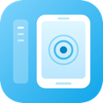
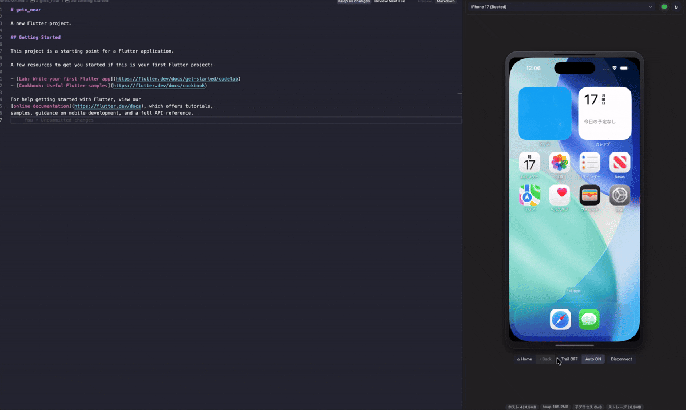
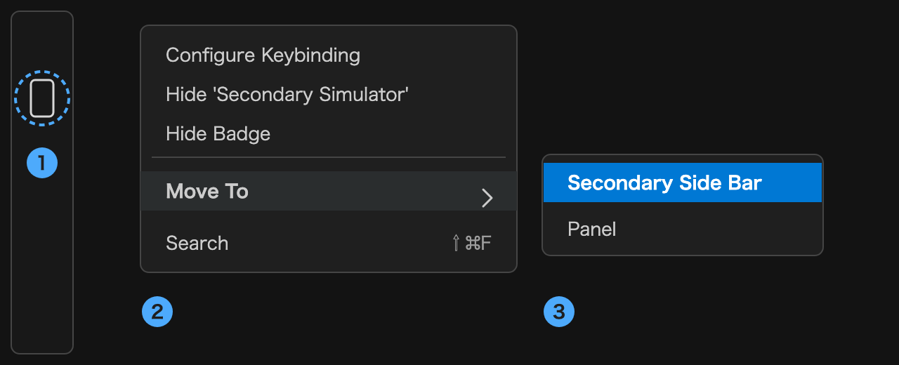

<p align="center">
  
</p>

# Secondary Simulator

[](https://github.com/den0206/secondary-simulator/actions/workflows/ci.yml)
[](https://github.com/den0206/secondary-simulator/actions/workflows/release.yml)
[](LICENSE.md)

**English** | [日本語](README_JP.md)

A VS Code / Cursor extension that shows iOS Simulators and Android Emulators in the sidebar and lets you drive them in real time.

<p align="center">
  
</p>

> **First step after installing**: move the preview to the Secondary Side Bar so the device sits beside your code instead of covering the file tree.
> **Right-click the Secondary Simulator icon in the Activity Bar → Move To → Secondary Side Bar.**
> Dragging the icon to the right edge of the window does the same. The bundled walkthrough shows these steps too — **Help → Welcome**, and it opens on its own right after installing from the Marketplace.

<p align="center">
  
</p>

## 🎯 Overview

Secondary Simulator mirrors your device inside the editor, so you never have to bring the Xcode or Android Studio window forward. The screen arrives over MJPEG streaming, and on the iOS Simulator input is injected directly as HID events for minimal latency.

## ✨ Features

- **📱 Universal device support**: iOS/Android simulators, emulators, and physical devices
- **🖥️ Real-time preview**: high frame rate mirroring over MJPEG streaming
- **👆 Interactive control**: raw Pointer Events are streamed through, so tap, swipe, drag, and pinch are recognized on the device itself
- **⚡ Low latency**: HID injection on the iOS Simulator (`native/simhid-server`), with automatic fallback to WDA
- **🔄 Unified API**: consistent device control through `mobilecli` (JSON-RPC 2.0)
- **🎬 Capture**: save a screenshot or record the screen straight to a file you choose
- **💾 Memory friendly**: streams, listeners, and timers are cleaned up to prevent leaks

## 📋 Requirements

- **VS Code / Cursor**: VS Code 1.90.0 or later (Node 20)
- **Node.js**: 20 or later (to run the extension host)
- **macOS**: required for the iOS Simulator and HID injection (Android-only use may work on other platforms, but is untested)
- **mobilecli**: `mobilecli` ships inside the VSIX. Only the darwin binaries are
  bundled, so on other platforms the extension falls back to `npx -y mobilecli@<pinned version>`,
  which downloads and runs the package from the network. The fallback is logged as a warning
- **iOS Simulator**: Xcode and the `simctl` command line tools
- **Android Emulator**: Android SDK and the `adb` command line tool

## 🚀 Installation

### Release build (VSIX)

Download `secondary-simulator-X.Y.Z.vsix` from [Releases](https://github.com/den0206/secondary-simulator/releases), then:

```bash
code --install-extension secondary-simulator-X.Y.Z.vsix   # use cursor --install-extension for Cursor
```

You can also use "Install from VSIX…" in the Extensions view, or search for it in Cursor / VSCodium (Open VSX).

### Building from source

```bash
# Install dependencies
npm install

# Build TypeScript and the native sidecar
npm run build

# Run the extension in VS Code
# Press F5 to launch the Extension Development Host
```

## ⚙️ Settings

- **`secondarySimulator.autoConnect`**: automatically connect to a booted device (default: true). While disconnected the sidebar polls every 5 seconds. The Auto button stays in sync; Disconnect turns this off.
- **`secondarySimulator.directStream`**: render the stream as a webview-native MJPEG `` (default: false, experimental). On the iOS Simulator this is served by the sidecar on 127.0.0.1; otherwise `MjpegProxy` relays mobilecli's MJPEG.
- **`secondarySimulator.streamScale`**: MJPEG scaling factor for iOS (default: 1.0 = original size)
- **`secondarySimulator.streamQuality`**: MJPEG JPEG quality for iOS, 1-100 (default: 80)
- **`secondarySimulator.captureSource`**: `auto` (default) grabs the iOS Simulator's framebuffer through the HID sidecar — the software keyboard and status bar are included; `wda` keeps the old mobilecli/WDA MJPEG stream, which only renders the app's own window. Falls back to WDA automatically when the sidecar is unavailable.
- **`secondarySimulator.captureFps`**: sidecar capture fps while idle (default: 30). Doubles (capped at 60) while a finger is down. Unchanged frames are not sent.
- **`secondarySimulator.captureMaxWidth`**: upper bound for sidecar JPEG width, in px (default: 640). Actual width follows the sidebar size × devicePixelRatio.
- **`secondarySimulator.captureMode`**: `auto` (default) uses display-change notifications when available, otherwise polling; `poll` stays on the timer. Private API, so pin to `poll` if an Xcode update breaks capture.
- **`secondarySimulator.recordingSource`**: where a recording comes from — `device` (default) records on the device, at full device resolution, but taps and the mouse pointer are not part of the device's own screen, so they never appear; `view` records what the sidebar shows, including tap markers, the drag trail and the pointer. The `view` route encodes in the webview, so picture quality follows the stream you see, and the file is MP4 or WebM depending on what this Chromium can encode.
- **`secondarySimulator.showDeviceFrame`**: draw the phone bezel around the screen (default: true). Turn it off to use the full width of a narrow sidebar.
- **`secondarySimulator.showResourceStats`**: show memory and extension-size figures in the footer (default: false). These are developer diagnostics; the video rate and input path are always shown.
- **`secondarySimulator.keyInput`**: how keystrokes reach an iOS Simulator — `hid` (default, fast) or `wda` (~370ms per character). HID keys arrive as a _hardware_ keyboard, so iOS stops drawing the software keyboard; pick `wda` when you want to see it in the sidebar. Touch always stays on HID.
- **`secondarySimulator.logLevel`**: verbosity of the **Secondary Simulator** output channel — `off` / `error` / `warn` / `info` (default) / `debug`. VS Code keeps the channel's full text in memory and offers no way to drop old lines, so keep this at `info` or below unless you are investigating something.

There are no gesture threshold settings: tap, swipe, and long press are all recognized on the device side.

## 📖 Usage

1. Open VS Code and activate the extension
2. The **Secondary Simulator** activity bar appears in the sidebar (view name: Device Preview)
3. Move it to the Secondary Side Bar so the device sits beside your code instead of covering the file tree: **right-click the Secondary Simulator icon in the Activity Bar → Move To → Secondary Side Bar** (dragging the icon to the right edge of the window does the same). The bundled walkthrough (**Help → Welcome**) shows the same steps. To undo it, right-click again and pick Move To → Side Bar
4. Pick a device from the dropdown (↻ refreshes the list). With Auto ON, a booted device is selected for you.
5. The device screen is mirrored in real time
6. Interact with the mouse or touchpad:
   - **Click / tap**: single tap
   - **Double click**: double tap
   - **Click & drag**: swipe and drag (follows your pointer)
   - **Press and hold**: long press
   - **Home**: control below the preview
   - **Back**: Android only (disabled on iOS)
   - **Shot**: save a screenshot of the connected device
   - **Rec**: record the screen to a video file. Recording begins after a three-second
     countdown shown over the screen, so you can get the device ready (press again to stop).
     Set `secondarySimulator.recordingSource` to `view` to record your taps, drag trail and
     pointer along with the screen
   - **Trail**: toggle ripple and drag trail overlay
   - **Auto**: toggle automatic connection to a booted device
7. Type with the keyboard while the preview has focus. Arrow keys and shortcuts with `Cmd` / `Ctrl` / `Option` (e.g. `Cmd+A`, `Cmd+C`) are forwarded as real modifier combinations — HID route only, since WDA cannot send modifiers. Keys are not forwarded while a form control (such as the device dropdown) has focus.
8. Paste with `Cmd+V` / `Ctrl+V` to send clipboard text to the device in one go, instead of a character at a time.

Picking a stopped device from the dropdown offers to boot it, the same as the command palette does.

The status bar (bottom right) shows the connected device and whether input is going through **HID** or **WDA**; the same label appears in the sidebar footer. A silent demotion from HID to WDA is visible there.

## ⌨️ Commands

Open the command palette (`Cmd+Shift+P`) and filter by **Secondary Simulator:**.
Refresh and logs (show / clear) are also available as icons in the view title bar. Screenshot is the **Shot** button below the preview (or the command palette).

| Command               | Description                                                      |
| --------------------- | ---------------------------------------------------------------- |
| `Select Device`       | Pick a device from a list and connect. Picking a stopped one offers to boot it |
| `Save Screenshot`     | Save the connected device's screen to a file                     |
| `Record Screen`       | Start/stop recording the screen to a video file. Starts after a three-second countdown; stops automatically after 10 minutes or on disconnect. `secondarySimulator.recordingSource` decides whether your taps and pointer are in it |
| `Open URL on Device`  | Open a deep link or URL on the connected device                  |
| `Press Home`          | Home button (`Cmd+Shift+H`)                                      |
| `Press Back`          | Back button, Android only (`Cmd+Shift+B`)                        |
| `Refresh Device List` | Re-fetch the device list (`Cmd+Shift+R`)                         |
| `Show Logs`           | Open the Secondary Simulator output channel                      |
| `Clear Logs`          | Empty the output channel (VS Code keeps its full text in memory) |

Key bindings apply only while the sidebar view has focus.

## 🏗️ Project structure

```
secondary-simulator/
├── src/
│   ├── extension.ts                    # Extension entry point
│   ├── simulator/
│   │   ├── types.ts                   # Type definitions
│   │   ├── RecordingName.ts           # Default recording file names
│   │   ├── RecordingFile.ts           # Finished-file check (mp4 moov / webm cluster)
│   │   ├── ViewRecording.ts           # View-recording chunk sink (limits, backpressure)
│   │   └── autoConnect.ts             # Pick a booted device for auto-connect
│   ├── webview/
│   │   └── SimulatorWebviewProvider.ts # Webview management
│   ├── capture/
│   │   ├── CaptureStrategy.ts         # Capture interface
│   │   ├── MjpegCapture.ts            # MJPEG streaming (relayed by the host)
│   │   ├── MjpegParser.ts             # Incremental multipart parsing
│   │   ├── MjpegProxy.ts              # MJPEG proxy (webview  path)
│   │   ├── Screenshot.ts              # device.screenshot response decoding
│   │   └── WdaSettings.ts             # WDA MJPEG bandwidth settings (iOS)
│   ├── input/
│   │   ├── InputBackend.ts            # Input backend abstraction
│   │   ├── SimhidSidecar.ts           # simhid-server process management (JSON Lines)
│   │   ├── HidSidecarBackend.ts       # Direct HID injection backend
│   │   ├── AndroidBackend.ts          # Android touch (stream latest point while pressed)
│   │   ├── AdbTouch.ts                # Persistent `adb shell` for motionevent
│   │   ├── WdaBackend.ts              # WDA/mobilecli fallback
│   │   └── SimulatorInputController.ts # Backend selection and degradation
│   ├── ui/
│   │   └── DeviceStatusBar.ts          # Status bar: connected device and input route
│   └── utils/
│       ├── Logger.ts                  # Logging
│       ├── MobileCliClient.ts         # mobilecli client
│       ├── MobileCliServer.ts         # mobilecli server management
│       ├── JsonRpcClient.ts           # JSON-RPC 2.0 client
│       ├── ResourceStats.ts           # RSS / heap / child process / storage
│       └── Strings.ts                 # Strings handed to the status bar and webview
├── native/
│   └── simhid-server.m                # HID injection sidecar (macOS / iOS Simulator)
├── media/
│   ├── icon.svg / icon.png            # Extension icon
│   └── webview/                       # Webview HTML/CSS/JS
├── scripts/
│   └── build-native.sh                # Universal build for simhid-server
├── test/                              # Tests on the Node runtime (no framework)
├── docs/                              # Design and research notes
├── .github/workflows/                 # CI and release
├── out/                               # Compiled output
├── package.json                       # Project manifest
├── package.nls.json / package.nls.ja.json / package.nls.zh-cn.json  # Command and setting names per locale
├── l10n/                               # Runtime message bundles (ja / zh-cn)
└── tsconfig.json                     # TypeScript config
```

## 🔧 Tech stack

- **Languages**: TypeScript / Objective-C (sidecar)
- **Runtime**: Node.js (VS Code extension host)
- **Key dependency**: `mobilecli` for device control and streaming
- **Protocols**: JSON-RPC 2.0 (mobilecli) / JSON Lines (sidecar)
- **Streaming**: MJPEG

## 🎨 Architecture

### Capture

1. **Per-frame delivery (default)** — the extension host receives frames, forwards them to the webview, and shows them as a data URL on an ``. On the iOS Simulator, `SidecarCapture` encodes the device framebuffer directly (the software keyboard is included), and the capture width and fps follow the panel size and whether you are touching the screen
2. **Direct MJPEG (`directStream`, experimental)** — the webview `` receives multipart directly. The iOS Simulator sidecar serves 127.0.0.1 itself; otherwise `MjpegProxy` relays mobilecli.

### Device input

- **Direct HID injection**: on the iOS Simulator, `native/simhid-server` injects HID events (lowest latency)
- **Android touch**: `AdbTouch` writes `motionevent` to a persistent `adb shell`. If adb is missing, it falls back to mobilecli
- **WDA fallback**: iOS physical devices, HID init/runtime failure, and Android keys/buttons go through `mobilecli`
- **Coordinates**: normalized (0-1) across the whole pipeline; pixel conversion happens inside each backend

### Memory management

- **Resource cleanup**: streams, event listeners, and timers are all released
- **Process management**: the mobilecli server, the sidecar, and the Android `adb shell` session are started and disposed in one place

## 🌐 Languages

The UI follows the VS Code / Cursor display language.

| Language | Locale | Notes |
|---|---|---|
| English | (default) | Used when no bundle matches the display language |
| 日本語 | `ja` | |
| 简体中文 | `zh-cn` | |

Command names and setting descriptions come from `package.nls*.json`; runtime
messages come from `l10n/bundle.l10n.*.json`. The sidebar receives its strings
already translated from the extension host, so nothing flashes in English first.

Log output in the "Secondary Simulator" channel is not localized — it is
developer-facing diagnostics rather than UI.

To add a language, drop in `package.nls.<locale>.json` and
`l10n/bundle.l10n.<locale>.json`, then add the locale to `LOCALES` in
`test/localization.test.js`; the test fails on any missing or stale string.

## 🐛 Troubleshooting

### No devices listed

- Make sure an iOS Simulator or Android Emulator is running
- Make sure `simctl` (iOS) or `adb` (Android) is on your PATH
- Check the extension log to confirm the mobilecli server is running

### Streaming problems

- Check the extension log to confirm the mobilecli server started correctly
- For remote devices, check network connectivity
- If bandwidth is short, lower `streamScale` / `streamQuality`

### Input feels slow or unresponsive

- Check the "Secondary Simulator" output channel to see whether the HID or WDA backend is active
- HID is available **only on the iOS Simulator**; latency rises after falling back to WDA
- Verify the sidecar is present (`native/simhid-server`)

## 📝 Development

```bash
npm run build      # TypeScript + simhid-server (native build is skipped off macOS)
npm run compile    # TypeScript only
npm run typecheck  # Type check only
npm test           # Tests (includes compile)
npm run watch      # Watch mode
npm run package    # Produce vsix/secondary-simulator.vsix
npm run clean      # Remove build output
```

See [CLAUDE.md](CLAUDE.md) for working conventions and architecture notes, and [docs/](docs) for design documents.

## 🚢 Releasing

1. Create a `release/Ver_X.Y.Z` branch from `main` and push it
2. GitHub Actions ([release.yml](.github/workflows/release.yml)) type checks, tests, builds the VSIX, creates a GitHub Release tagged `Ver_X.Y.Z`, and attaches the VSIX
3. If `OVSX_TOKEN` is configured, it also publishes to Open VSX (skipped otherwise)
4. The `[Unreleased]` section of `CHANGELOG.md` is cut into `## [X.Y.Z] — date` (before the VSIX is built)
5. The `package.json` version and the updated `CHANGELOG.md` are synced back to `main` automatically

Notes:

- **The changelog is written in English** so the public pages read the same for everyone.
  Use the Keep a Changelog section names (`Added` / `Changed` / `Deprecated` / `Removed` /
  `Fixed` / `Security`); `test/changelog.test.js` enforces both
- **Do not move changelog entries by hand.** Add them under `[Unreleased]`;
  [`scripts/release-changelog.js`](scripts/release-changelog.js) moves them under a
  version heading at release time. The public page (Open VSX / Marketplace) renders
  the **CHANGELOG.md inside the VSIX**, so the cut happens before packaging
- Releasing with an empty `[Unreleased]` creates no version heading (no empty sections)
- If `Ver_X.Y.Z` already exists, the rebuild is numbered `Ver_X.Y.Z+1` (published releases are immutable)
- A version older than the latest existing release is rejected
- Release notes come from `docs/release-notes/X.Y.Z.md` if present, otherwise they are generated
- The Open VSX namespace has to be created once by hand: `npx ovsx create-namespace yuuki-sakai -p <token>`

## 📄 License

[MIT](LICENSE.md)

The VSIX bundles `mobilecli` 1.0.2, which is licensed under **FSL-1.1-ALv2**
(the npm metadata says MIT, but the upstream `LICENSE` at that tag does not).
FSL is a source-available licence, not an OSI-approved open source one: it
permits any use except a *Competing Use*, meaning making the software available
to others in a commercial product or service with substantially similar
functionality. Secondary Simulator is free of charge and merely invokes
mobilecli as a separate process, and ships it unmodified. See
[THIRD-PARTY-NOTICES.md](THIRD-PARTY-NOTICES.md) for the full text and where to
get its source.

## 🤝 Contributing

Contributions are welcome. Please open pull requests from a `feature/**` or `fix/**` branch so CI runs automatically.

## 📚 References

- [VS Code Extension API](https://code.visualstudio.com/api)
- [mobilecli Documentation](https://github.com/mobile-next/mobilecli)
- [MJPEG Streaming](https://en.wikipedia.org/wiki/Motion_JPEG)
