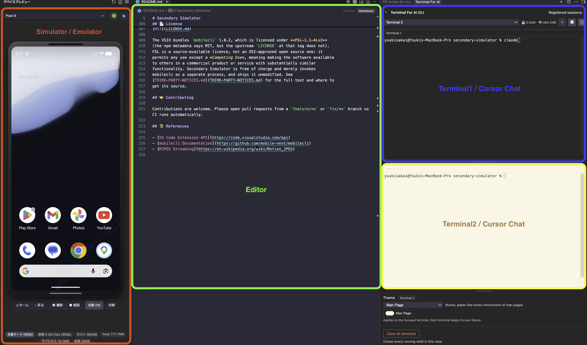

<p align="center">
  
</p>

# Secondary Simulator

[](https://github.com/den0206/secondary-simulator/actions/workflows/ci.yml)
[](https://github.com/den0206/secondary-simulator/actions/workflows/release.yml)
[](LICENSE.md)

[English](README.md) | **日本語**

VSCode / Cursor 拡張機能として、iOS/Androidシミュレータとエミュレータをサイドバーに表示し、リアルタイムで操作できる機能を提供します。

<p align="center">
  
</p>

> **インストール後の最初の一手**: プレビューをセカンダリサイドバーへ移すと、ファイルツリーを覆わずコードの隣にデバイスが並びます。
> **アクティビティバーの Secondary Simulator のアイコンを右クリック →［移動先］→［セカンダリ サイド バー］。**
> アイコンをウィンドウ右端へドラッグしても同じです。同梱の導入ガイド（**［ヘルプ］→［ようこそ］**）にも同じ手順が出ます。Marketplace から入れた直後は自動で開きます。

<p align="center">
  
</p>

### 🧩 モバイル開発者におすすめのレイアウト

<p align="center">
  
</p>

左にデバイス、中央にコード、右に AI CLI のターミナル。エージェントがコードを直すあいだ、ウィンドウを切り替えずにアプリの反応をそのまま見られます。右側のターミナルは [Terminal For AI CLI](https://open-vsx.org/extension/yuuki-sakai/terminal-for-ai-cli)（作者による別の拡張機能）で、Claude Code や Cursor Agent などの CLI セッションをセカンダリサイドバーにまとめて置けます。

この並びではプレビューはセカンダリサイドバーへ移さず、プライマリサイドバーに置いたままにします。画面の広さに合わせてどちらかを選んでください。

## 🎯 概要

Secondary Simulatorは、XcodeやAndroid Studioのシミュレータウィンドウを開くことなく、エディタのサイドバーから直接デバイスを表示・操作できる拡張機能です。MJPEGストリーミングによる低レイテンシな画面表示と、iOS Simulator への HID 直接注入による低遅延な操作を実現しています。

## ✨ 主な機能

- **📱 ユニバーサルデバイスサポート**: iOS/Androidのシミュレータ、エミュレータ、実機デバイスに対応
- **🖥️ リアルタイムプレビュー**: MJPEGストリーミングによる高フレームレートの画面ミラーリング
- **👆 インタラクティブ操作**: Pointer Events を生配信し、タップ・スワイプ・ドラッグ・ピンチをデバイス側で判定
- **⚡ 低レイテンシ**: iOS Simulator では HID を直接注入（`native/simhid-server`）、失敗時は WDA へ自動降格
- **🔄 統一API**: `mobilecli`（JSON-RPC 2.0）による一貫したデバイス制御
- **🎬 記録**: スクリーンショットと画面録画を、指定した保存先へ直接書き出し
- **💾 メモリ効率**: ストリーム・リスナー・タイマーのクリーンアップでメモリリークを防止

## 📋 要件

- **VSCode / Cursor**: VSCode バージョン 1.90.0 以上（Node 20）
- **Node.js**: 20 以上（拡張機能ホストの実行に必要）
- **macOS**: iOS Simulator の利用と HID 直接注入に必要（Android のみなら他 OS でも動作しますが未検証）
- **mobilecli**: `mobilecli` を VSIX に同梱。同梱するのは darwin 版バイナリだけなので、
  他 OS では `npx -y mobilecli@<固定版>` にフォールバックする（パッケージを
  ネットワークから取得して実行する）。フォールバックした場合は警告としてログに残る
- **iOS Simulator**: Xcodeと`simctl`コマンドラインツールが必要
- **Android Emulator**: Android SDKと`adb`コマンドラインツールが必要

## 🚀 インストール

### リリース版（VSIX）

[Releases](https://github.com/den0206/secondary-simulator/releases) から `secondary-simulator-X.Y.Z.vsix` をダウンロードし、

```bash
code --install-extension secondary-simulator-X.Y.Z.vsix   # Cursor なら cursor --install-extension
```

または拡張機能ビューの「…」→「VSIX からのインストール」を使います。Cursor / VSCodium の拡張機能検索（Open VSX）からも入手できます。

### 開発版のビルド

```bash
# 依存関係のインストール
npm install

# TypeScript とネイティブサイドカーのビルド
npm run build

# VSCodeで拡張機能を実行
# F5キーを押してExtension Development Hostを起動
```

## ⚙️ 設定

VSCodeの設定で以下のオプションを調整できます：

- **`secondarySimulator.autoConnect`**: 起動中のデバイスへ自動接続する（デフォルト: true）。未接続のあいだは 5 秒ごとに探す。Auto ボタンと連動し、Disconnect で OFF になる。
- **`secondarySimulator.autoShow`**: デバッグを開始したとき、サイドバーが表示されていなければ表示する（デフォルト: true）。キーボードのフォーカスは移らないので、打鍵はエディタに入ったまま。検知できるのはデバッグセッション（Run and Debug / F5）だけで、ターミナルから直接実行した場合は分からない。
- **`secondarySimulator.autoShowDebugTypes`**: サイドバーを表示するデバッグの種別（launch.json の `type`。デフォルト: `dart` / `reactnative` / `reactnativedirect` / `android` / `sweetpad-lldb`）。Flutter は iOS でも Android でも `dart` なので 1 つで両方に効く。空配列にすると、すべてのデバッグで表示する。
- **`secondarySimulator.directStream`**: 表示を webview 直結 MJPEG（``）にする（デフォルト: false・実験的）。iOS Simulator ではサイドカーが 127.0.0.1 で配信し、それ以外は `MjpegProxy` が mobilecli の MJPEG を中継する。
- **`secondarySimulator.streamScale`**: iOS の MJPEG 縮小率（デフォルト: 1.0＝原寸）
- **`secondarySimulator.streamQuality`**: iOS の MJPEG JPEG 品質 1-100（デフォルト: 80）
- **`secondarySimulator.captureSource`**: `auto`（デフォルト）は HID サイドカー経由で iOS Simulator のフレームバッファを取り込む（ソフトウェアキーボード・ステータスバーも写る）。`wda` は従来の mobilecli/WDA MJPEG（アプリのウィンドウのみ）。サイドカーが使えないときは自動で WDA へ降格する。
- **`secondarySimulator.captureFps`**: サイドカー取り込みの通常時 fps（デフォルト: 30）。指を置いているあいだは最大 2 倍・60fps。変化のないフレームは送られない。
- **`secondarySimulator.captureMaxWidth`**: サイドカーが送る JPEG 幅の上限 px（デフォルト: 640）。実際の幅はサイドバーの表示幅 × devicePixelRatio に追従する。
- **`secondarySimulator.captureMode`**: `auto`（デフォルト）はディスプレイの変更通知が使えれば使い、駄目ならポーリング。`poll` はタイマ固定。私有 API なので、Xcode 更新で取り込みが不調なときは `poll` に固定する。
- **`secondarySimulator.recordingSource`**: 録画の作り方 — `view`（既定）はサイドバーに出ている映像を、マウスカーソルとタップごと録る（ドラッグ軌跡は `secondarySimulator.showTouchTrail` を ON にしたときだけ）。`device` は端末側で録るので端末の解像度で残せるが、カーソルとタップは端末の画面そのものには無いため写らない。`view` は webview で符号化するので、ファイルは Chromium が符号化できるほうに応じて MP4 か WebM になる。録画のあいだは取り込み幅を 1080px より下げないので、サイドバーの狭さがそのままファイルの解像度になることはない（この幅上げが効くのはサイドカー経路だけで、WDA / Android では表示中の映像に従う）。端末の解像度で残したくてカーソルが要らないなら `device`。
- **`secondarySimulator.showTouchTrail`**: タップした場所にリップルを出し、ドラッグ中は軌跡を描く（デフォルト: false）。サイドバーの上に重ねるだけで、`view` の録画にも写る。
- **`secondarySimulator.showDeviceFrame`**: 画面のまわりに端末の筐体を描く（デフォルト: true）。サイドバーが狭いときは OFF にすると横幅をすべて使える。
- **`secondarySimulator.showResourceStats`**: フッターにメモリと拡張ディレクトリのサイズを出す（デフォルト: false）。開発者向けの診断で、映像レートと入力経路は常に出る。
- **`secondarySimulator.keyInput`**: iOS Simulator へのキー入力経路。`hid`（デフォルト・高速）または `wda`（1文字あたり約 370ms）。HID のキーはハードウェアキーボード扱いになるためソフトウェアキーボードが出ない。サイドバーにソフトキーボードを映したいときは `wda`。タッチは常に HID。
- **`secondarySimulator.saveLocation`**: スクリーンショットと録画の保存ダイアログで最初に開くフォルダ。`desktop`（デフォルト・`~/Desktop`） / `workspace`（ワークスペースのルート。フォルダを開いていなければホーム） / `home` / `custom`（`saveDirectory` のパス）。ダイアログで選んだ場所以外へは書かない。
- **`secondarySimulator.saveDirectory`**: `saveLocation` が `custom` のときに使うフォルダパス。それ以外では無視され、空ならホームへ倒す。
- **`secondarySimulator.logLevel`**: 出力チャンネル **Secondary Simulator** へ書くログの詳しさ。`off` / `error` / `warn` / `info`（デフォルト） / `debug`。VS Code は出力チャンネルの全文をメモリに保持し古い行を捨てられないため、調査時以外は `info` 以下にする。

タップ/スワイプ/ロングプレスの判定はデバイス側が行うため、閾値の設定項目はありません。

## 📖 使用方法

1. VSCodeを開き、拡張機能をアクティブ化
2. サイドバーに **Secondary Simulator** アクティビティバーが出る（ビュー名は Device Preview）
3. セカンダリサイドバーへ移すと、ファイルツリーを覆わずコードの隣にデバイスが並びます。**アクティビティバーの Secondary Simulator のアイコンを右クリック →［移動先］→［セカンダリ サイド バー］**（アイコンをウィンドウ右端へドラッグしても同じ）。同梱の導入ガイド（**［ヘルプ］→［ようこそ］**）にも同じ手順が出ます。Marketplace から入れた直後は自動で開きます。戻すときは同じ右クリックから［移動先］→［サイド バー］
4. ドロップダウンメニューからデバイスを選択（↻ で一覧を再取得）。Auto ON なら起動中のデバイスへ自動で繋ぐ
5. デバイス画面がリアルタイムで表示されます
6. マウス/タッチでデバイスと対話：
   - **クリック/タップ**: シングルタップ
   - **ダブルクリック**: ダブルタップ
   - **クリック&ドラッグ**: スワイプ・ドラッグ（追従）
   - **長押し**: 押下したまま静止でロングプレス
   - **Home**: プレビュー下のボタン
   - **Back**: Android のみ（iOS では無効）
   - **Shot**: 接続中デバイスの画面を保存
   - **Rec**: 画面を動画ファイルへ録画。保存先を選ぶと画面に 3 秒の秒読みが出て、
     数え終わってから録り始める（もう一度押すと停止）。録画にはマウスカーソルとタップが
     写る。端末側で録りたいときは `secondarySimulator.recordingSource` を
     `device` にする
   - **Auto**: 起動中デバイスへの自動接続の切替
7. プレビューにフォーカスがあるあいだはキーボードで入力できます。矢印キーと、`Cmd` / `Ctrl` / `Option` を伴うショートカット（`Cmd+A`・`Cmd+C` など）は修飾キー付きの組み合わせとして送られます（HID 経路のみ。WDA は修飾キーを扱えません）。デバイス選択などのフォーム要素にフォーカスがあるあいだは送りません
8. `Cmd+V` / `Ctrl+V` でクリップボードのテキストを 1 回でまとめてデバイスへ入力できます（1 文字ずつではありません）

ドロップダウンから停止中のデバイスを選んだときも、コマンドパレットと同じように起動を尋ねます。

ステータスバー（右下）に接続中のデバイスと入力経路（**HID** / **WDA** / **ADB**）が出ます。Android は WebDriverAgent を経由しないので **ADB** と出ます。サイドバー下部にも同じラベルが出るので、HID から WDA へ無音で降格したことに気づけます。

## ⌨️ コマンド

コマンドパレット（`Cmd+Shift+P`）から **Secondary Simulator:** で絞り込めます。
再取得・ログ（表示 / 消去）はビュータイトルのアイコンからも実行できます。スクリーンショットはプレビュー下の **Shot**（またはコマンドパレット）です。

| コマンド              | 説明                                                         |
| --------------------- | ------------------------------------------------------------ |
| `Select Device`       | 一覧から選んで接続する。停止中を選ぶと起動できる             |
| `Save Screenshot`     | 接続中のデバイスの画面を保存する                             |
| `Record Screen`       | 画面の録画を 3 秒の秒読みのあと開始 / 停止する。10 分経過または切断でも必ず止まる。`secondarySimulator.recordingSource` が `device` でなければカーソルとタップも写る |
| `Open URL on Device`  | 接続中のデバイスでディープリンク / URL を開く                |
| `Press Home`          | Home ボタン（`Cmd+Shift+H`）                                 |
| `Press Back`          | Back ボタン・Android のみ（`Cmd+Shift+B`）                   |
| `Refresh Device List` | デバイス一覧を再取得する（`Cmd+Shift+R`）                    |
| `Show Logs`           | 出力パネルの Secondary Simulator を開く                      |
| `Clear Logs`          | 出力チャンネルを空にする（VS Code が全文をメモリに持つため） |

キーバインドはサイドバーにフォーカスがあるときだけ効きます。

## 🏗️ プロジェクト構造

```
secondary-simulator/
├── src/
│   ├── extension.ts                    # 拡張機能のエントリーポイント
│   ├── simulator/
│   │   ├── types.ts                   # 型定義
│   │   ├── RecordingName.ts           # 録画ファイル名の既定値
│   │   ├── RecordingFile.ts           # 書き出し後の検査（mp4 の moov / webm の Cluster）
│   │   ├── ViewRecording.ts           # ビュー録画のチャンク受け口（上限・逆圧）
│   │   ├── autoConnect.ts             # 自動接続する起動中デバイスの選択
│   │   └── autoShow.ts                # デバッグ開始でビューを出すかの判定
│   ├── webview/
│   │   └── SimulatorWebviewProvider.ts # Webview管理
│   ├── capture/
│   │   ├── CaptureStrategy.ts         # キャプチャインターフェース
│   │   ├── MjpegCapture.ts            # MJPEGストリーミング実装（拡張ホスト中継）
│   │   ├── MjpegParser.ts             # multipart のインクリメンタル解析
│   │   ├── MjpegProxy.ts              # MJPEG 直結プロキシ（webview  経路）
│   │   ├── Screenshot.ts              # device.screenshot 応答のデコード
│   │   └── WdaSettings.ts             # WDA の MJPEG 帯域設定（iOS）
│   ├── input/
│   │   ├── InputBackend.ts            # 入力バックエンドの抽象
│   │   ├── SimhidSidecar.ts           # simhid-server プロセス管理（JSON Lines）
│   │   ├── HidSidecarBackend.ts       # HID 直接注入バックエンド
│   │   ├── AndroidBackend.ts          # Android タッチ（押しているあいだ最新点を送る）
│   │   ├── AdbTouch.ts                # motionevent 用の常駐 `adb shell`
│   │   ├── WdaBackend.ts              # WDA/mobilecli フォールバック
│   │   └── SimulatorInputController.ts # バックエンド選択と降格
│   ├── ui/
│   │   └── DeviceStatusBar.ts          # ステータスバー（接続中デバイスと入力経路）
│   └── utils/
│       ├── Logger.ts                  # ログ管理
│       ├── MobileCliClient.ts         # mobilecliクライアント
│       ├── MobileCliServer.ts         # mobilecliサーバー管理
│       ├── JsonRpcClient.ts           # JSON-RPC 2.0クライアント
│       ├── ResourceStats.ts           # RSS / heap / 子プロセス / 拡張ディレクトリ
│       └── Strings.ts                 # ステータスバーと webview へ渡す文言
├── native/
│   └── simhid-server.m                # HID 注入サイドカー（macOS/iOS Simulator）
├── media/
│   ├── icon.svg / icon.png            # 拡張機能アイコン
│   └── webview/                       # WebviewのHTML/CSS/JS
├── scripts/
│   └── build-native.sh                # simhid-server の universal ビルド
├── test/                              # Node 標準のテスト（フレームワークなし）
├── docs/                              # 設計・調査ドキュメント
├── .github/workflows/                 # CI とリリース
├── out/                               # コンパイル済みファイル
├── package.json                       # プロジェクト設定
├── package.nls.json / package.nls.ja.json / package.nls.zh-cn.json  # コマンド名・設定説明の翻訳
├── l10n/                               # 実行時メッセージの翻訳（ja / zh-cn）
└── tsconfig.json                     # TypeScript設定
```

## 🔧 技術スタック

- **言語**: TypeScript / Objective-C（サイドカー）
- **ランタイム**: Node.js (VSCode Extension Host)
- **主要ライブラリ**:
  - `mobilecli`: デバイス操作とストリーミング
- **通信プロトコル**: JSON-RPC 2.0（mobilecli）/ JSON Lines（サイドカー）
- **ストリーミング**: MJPEG

## 🎨 アーキテクチャ

### キャプチャ方式

1. **フレーム個別配信（デフォルト）**
   - 拡張ホストがフレームを受けて webview へ転送し、`` の data URL として表示
   - iOS Simulator では `SidecarCapture` が端末のフレームバッファを直接 JPEG 化する
     （ソフトウェアキーボードも写る）。取り込む幅と fps は表示幅と操作状態に追従する
2. **MJPEG 直結（`directStream`・実験的）**
   - webview の `` が multipart を直接受ける。iOS Simulator ではサイドカーが
     127.0.0.1 で配信し、それ以外は `MjpegProxy` が mobilecli を中継する

### デバイス操作

- **HID 直接注入**: iOS Simulator では `native/simhid-server` が HID イベントを注入（最低遅延）
- **Android タッチ**: `AdbTouch` が常駐 `adb shell` へ `motionevent` を書く。adb が無ければ mobilecli へ落ちる
- **WDA フォールバック**: iOS 実機、HID 初期化/実行の失敗、Android のキー・ボタンは `mobilecli` 経由
- **座標変換**: 正規化座標（0-1）でやり取りし、ピクセル変換は各バックエンドの内側で行う

### メモリ管理

- **リソースクリーンアップ**: ストリーム、イベントリスナー、タイマーの適切な解放
- **プロセス管理**: mobilecli サーバー、サイドカー、Android の `adb shell` の起動・再接続・破棄を一元管理

## 🌐 表示言語

UI は VS Code / Cursor の表示言語に従う。

| 言語 | ロケール | 備考 |
|---|---|---|
| English | （既定） | 一致するバンドルが無い言語はこれになる |
| 日本語 | `ja` | |
| 简体中文 | `zh-cn` | |

コマンド名と設定の説明は `package.nls*.json`、実行時のメッセージは
`l10n/bundle.l10n.*.json` から引く。サイドバーの文言は拡張ホストが翻訳して
HTML に埋め込むので、**最初に英語が見えてから切り替わる、が起きない**。

出力チャンネル "Secondary Simulator" のログは翻訳しない（UI ではなく開発者向けの診断のため）。

言語を足すときは `package.nls.<locale>.json` と `l10n/bundle.l10n.<locale>.json` を置き、
`test/localization.test.js` の `LOCALES` に追加する。翻訳漏れや古い原文が残っていれば
テストが落ちる。

## 🐛 トラブルシューティング

### デバイスが表示されない

- iOS SimulatorまたはAndroid Emulatorが実行されていることを確認
- `simctl`（iOS）または`adb`（Android）がPATHに含まれていることを確認
- mobilecliサーバーが実行されていることを確認（拡張機能のログを確認）

### ストリーミングの問題

- mobilecliサーバーが正常に起動していることを確認（拡張機能のログを確認）
- リモートデバイスの場合はネットワーク接続を確認
- 帯域が足りない場合は `streamScale` / `streamQuality` を下げる

### 操作が遅い・反応しない

- 出力パネル「Secondary Simulator」で HID / WDA どちらのバックエンドか確認
- HID が使えるのは **iOS Simulator のみ**。WDA 降格時はレイテンシが上がる
- サイドカーが同梱されているか確認（`native/simhid-server`）

## 📝 開発

```bash
npm run build      # TypeScript + simhid-server（macOS 以外は native をスキップ）
npm run compile    # TypeScript のみ
npm run typecheck  # 型チェックのみ
npm test           # テスト（compile 込み）
npm run watch      # ウォッチモード
npm run package    # vsix/secondary-simulator.vsix を生成
npm run clean      # 生成物の削除
```

作業指針とアーキテクチャの要点は [CLAUDE.md](CLAUDE.md)、設計ドキュメントは [docs/](docs) を参照してください。

## 🚢 リリース

1. `main` から `release/Ver_X.Y.Z` ブランチを作成して push する
2. GitHub Actions（[release.yml](.github/workflows/release.yml)）が型チェック・テスト・VSIX 作成を行い、
   `Ver_X.Y.Z` タグで GitHub Release を作成して VSIX を添付する
3. `OVSX_TOKEN` が設定されていれば Open VSX にも公開する（未設定ならスキップ）
4. `CHANGELOG.md` の `[Unreleased]` が `## [X.Y.Z] — 日付` へ切り出される（VSIX に入る前）
5. `package.json` の version と切り出し後の `CHANGELOG.md` は自動で `main` に反映される

補足:

- **CHANGELOG は英語で書く**（コミットメッセージは日本語のまま）。公開ページは
  全世界から読まれるため。節の見出しは Keep a Changelog の `Added` / `Changed` /
  `Deprecated` / `Removed` / `Fixed` / `Security` を使う。
  日本語の混入と未知の見出しは `test/changelog.test.js` が落とす
- **CHANGELOG は手で移し替えない。** 変更は `[Unreleased]` に書き足すだけでよく、
  リリース時に [`scripts/release-changelog.js`](scripts/release-changelog.js) が
  バージョン見出しへ移す。公開ページ（Open VSX / Marketplace）が表示するのは
  **VSIX 内の CHANGELOG.md** なので、パッケージより前に切り出している
- `[Unreleased]` が空のままリリースするとバージョン見出しは作られない（空の節を量産しない）
- 同じ `Ver_X.Y.Z` が既にある場合は `Ver_X.Y.Z+1` として再ビルドされる（公開済みリリースは不変）
- 既存の最新版より古いバージョン名は拒否される
- リリースノートは `docs/release-notes/X.Y.Z.md` があればそれを使用し、無ければ自動生成
- Open VSX の名前空間は初回のみ手動作成が必要: `npx ovsx create-namespace yuuki-sakai -p <token>`

## 📄 ライセンス

[MIT](LICENSE.md)

VSIX には `mobilecli` 1.0.2 を同梱しており、こちらは **FSL-1.1-ALv2** です
（npm のメタデータは MIT ですが、該当タグの upstream `LICENSE` は FSL）。
FSL は OSI 承認のオープンソースではなく、*Competing Use*（同様の機能を持つ
**商用の**製品・サービスとして他者へ提供すること）だけを禁じるソース公開型の
ライセンスです。この拡張は無償で、mobilecli を別プロセスとして起動するだけで、
改変せずそのまま同梱しています。全文と入手先は
[THIRD-PARTY-NOTICES.md](THIRD-PARTY-NOTICES.md) を参照してください。

## 🤝 コントリビューション

コントリビューションを歓迎します。PR は `feature/**` または `fix/**` ブランチから作成してください（CI が自動で走ります）。

## 📚 参考資料

- [VSCode Extension API](https://code.visualstudio.com/api)
- [mobilecli Documentation](https://github.com/mobile-next/mobilecli)
- [MJPEG Streaming](https://en.wikipedia.org/wiki/Motion_JPEG)
